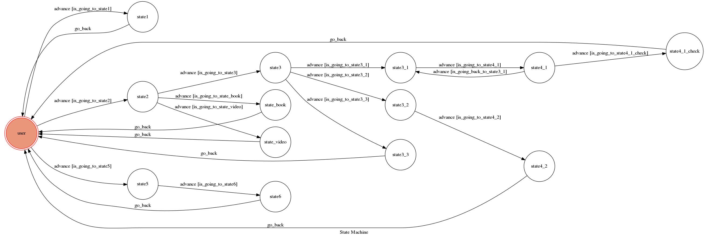

# TOC-Project-2017
### 計算機理論project

* A telegram bot based on a finite state machine

### Prerequisite
* Python2 or Python3

#### 執行環境
* Linux

### API_TOKEN and WEBHOOK_URL
`API_TOKEN` and `WEBHOOK_URL` in app.py **MUST** be set to proper values.
Otherwise, you might not be able to run the code.

code中的`API_TOKEN`和`WEBHOOK_URL`都需要被更改

#### 執行說明如下(Run Locally)
首先將ngrok這個執行檔(Linux 32位元)載下來並執行

Use `ngrok` as a proxy.

**`ngrok` would be used in the following instruction**
```sh
./ngrok http 5000
```
在本機執行時要執行此指令，`ngrok`會產生一個新的https URL

設定 `WEBHOOK_URL` (in app.py) to `your-https-URL/hook`.

#### Run the sever

```sh
python app.py
    or
python3 app.py
```

## Finite State Machine


## Usage
The initial state is set to `user`.

Every time `user` state is triggered to `advance` to another state, it will `go_back` to `user` state after the bot replies corresponding message.

* user

    bot回覆主要有三種類型：詢問類、服務類、打招呼類
    
    範例輸入輸出依序如下
    
    ---
    (詢問類)
    * Input: "who are you?" or "what can you do?"
	    * Reply: 
		I'm TattosBot,a Chatbot,maybe can provide you some service
        
        	If you need some service,please input "I need some service"
    
    (bot回覆完訊息後將會`go_back` 回到 `user` 狀態)
        
    ---
    (服務類-food、book、video)
    * Input: "I need some service"
        * Reply: 
		What type of service you need? 
		
        	(food,book,video)
    
    (bot會詢問使用者要選擇哪一項服務，我們從第一種服務開始依序舉例)
    
    (服務類food，bot會給使用者三個選項)
    * Input: "food"
	    * Reply: 
		What do you need?
		
        	(please input number)
	
        	(1)reserve a table
	
        	(2)order a meal
	
       		(3)ask other information
        
    (假設使用者要選擇第一項服務，則輸入如下)
    * Input: "1" or "(1)" or "reserve a table"
        * Reply: 
		Please input the total number of person and reservation time
		
        	(example: for five at 7:20 pm.)
    
    (之後bot會請使用者依格式輸入訂位人數與訂位時間)
    * Input: "for five at 8:00 pm"
        * Reply: 
		Check if the following information is correct(Y/N):
		
        	You reserve a table for five at 8:00 pm
        
    (bot 會記錄使用者的輸入，並請使用者再次確認)
    
    (假設使用者確定無誤，則輸入如下)
    * Input: "y" or "yes"
        * Reply: 
		All right.You has been booked successfully.
        
    (bot回覆完訊息後將會`go_back` 回到 `user` 狀態)
    
    (假設使用者認為訂位有誤，則輸入如下)
    * Input: "n" or "no"
        * Reply: 
		Please input the total number of person and reservation time
		
       		(example: for five at 7:20 pm.)
    
    (此時bot會再次詢問訂位人數與訂位時間，直到使用者確認無誤，並在確認訂位資訊時，輸入"y" or "yes"後，bot才會`go_back` 回到 `user` 狀態)
    
    ---
    (服務類food，選擇第二項)
	* Input: "food"
		* Reply: 
		What do you need?
		
        	(please input number)
	
        	(1)reserve a table
	
        	(2)order a meal
	
        	(3)ask other information
    * Input: "2" or "(2)" or "order a meal"
        * Reply: 
		What would you like to eat?
		
        	(please input number)
	
        	(1)Fried rice
	
        	(2)Pasta
    
    (此時bot會詢問你要點Fried rice或Pasta)
    
    (輸入如下)
    * Input: "1" or "(1)" or "Fried rice"
    
    or
    
    * Input: "2" or "(2)" or "Pasta"
    
        * Reply: 
		OK,we will serve you shortly.
        
    (不論選擇Fried rice或Pasta，bot都會回覆此訊息)
    
    (bot回覆完訊息後將會`go_back` 回到 `user` 狀態)
    
    ---
    (服務類food，選擇第三項)
    * Input: "food"
		* Reply: 
		What do you need?
		
        	(please input number)
	
        	(1)reserve a table
	
        	(2)order a meal
	
        	(3)ask other information
    * Input: "3" or "(3)" or "ask other information"
        * Reply: 
		If you have any other questions, please call customer service:
		
        	0800-XXX-XXX
        
    (bot回覆完訊息後將會`go_back` 回到 `user` 狀態)
    
    ---
    (服務類book，bot會直接推薦「博客來」的連結給用者)
	* Input: "book"
	    * Reply: 
		You may like this:
		
        	[博客來]
	
        	(http://www.books.com.tw/?gclid=CjwKCAjw07nJBRBGEiwAUXBPmfuWUBqlGHbSA08eP6nwThe814rd5aa-62PI6UsTWs5C8bp634oKXRoCnoYQAvD_BwE)
    
    (bot回覆完訊息後將會`go_back` 回到 `user` 狀態)
    
    ---
    (服務類video，bot會直接推薦「Youtube」的連結給用者)
    * Input: "video"
        * Reply: 
		You may like this:
		
        	[Youtube]
	
        	(https://www.youtube.com)
    
    (bot回覆完訊息後將會`go_back` 回到 `user` 狀態)
    
    ---
    (打招呼類)
	* Input: "hi" or "hello" or "good morning" or   "good afternoon" or "good evening" or "good night"
		* Reply: 
		Hi,what's your name?
     
    (接下來請輸入你的名字)
     * Input: "Jimmy"
         * Reply: 
		Hi~Jimmy,nice to meet you!
        
    (bot將使用者input的名字記錄下來並回覆)
    
    (bot回覆完訊息後將會`go_back` 回到 `user` 狀態)


## Author
[Tattos](https://github.com/Lee-W)


